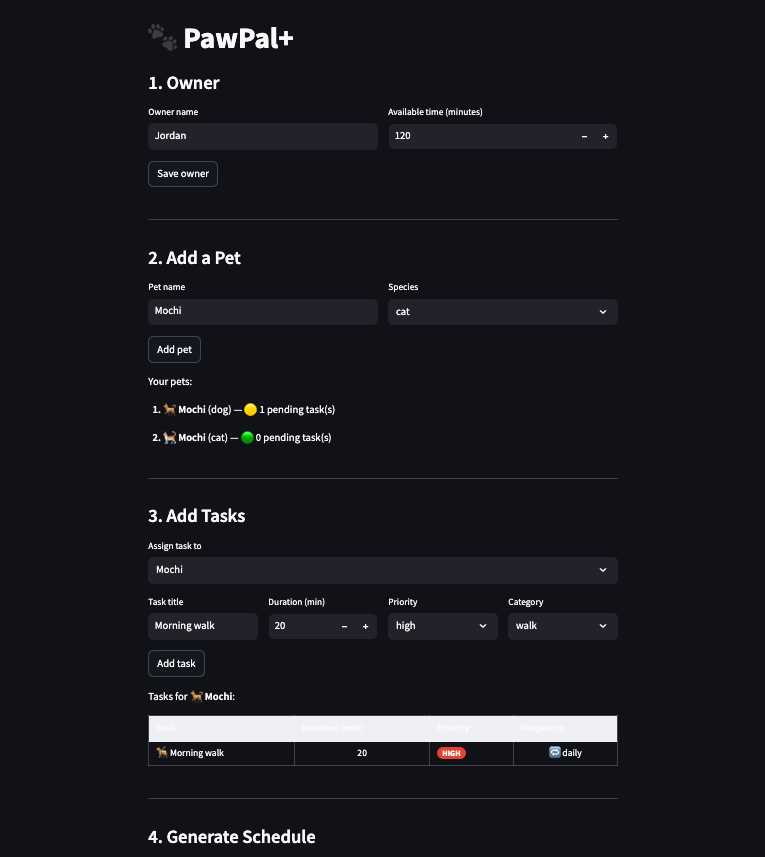

# PawPal+ 🐾

A smart daily pet-care scheduler I built with Python and Streamlit. PawPal+ helps pet owners stay on top of care routines by generating a prioritized, time-aware daily plan — and explaining every scheduling decision it makes.

## 📸 Demo

<a href="image.png" target="_blank"></a>

---

## What I Built

I designed and implemented a full-stack scheduling system from scratch — starting with a UML class diagram, through a Python backend with a greedy scheduling engine, and finally a polished Streamlit UI with real-time filtering, conflict warnings, and color-coded output.

The app lets a pet owner:
- Register multiple pets and assign care tasks with priority, category, and duration
- Generate a daily schedule that respects their available time budget
- View tasks sorted by priority or chronological order
- Get instant warnings when tasks overlap

---

## ✨ Features

| Feature | How it works |
|---|---|
| **Greedy priority scheduling** | I sort tasks `high → medium → low` before placement so the most important care always happens first. The scheduler never backtracks. |
| **Duration tie-breaking** | Within the same priority level, I schedule shorter tasks first — fitting more tasks into the daily budget. |
| **Hard time budget** | `Scheduler.remaining_minutes` decrements with each placed task. Anything that won't fit is skipped and reported, never silently dropped. |
| **Chronological sorting** | `sort_by_time()` sorts by integer `start_offset` — exact arithmetic, not fragile string comparison. |
| **Multi-level filtering** | Tasks can be sliced by pet, status, or category at the `Pet`, `Owner`, or `Scheduler` layer independently. |
| **Recurring tasks** | `Task.next_occurrence()` uses `timedelta` to auto-generate the next due date — `daily` (+1 day), `weekly` (+7 days), or `as-needed` (no recurrence). Completing a task appends its successor automatically. |
| **Conflict detection** | `detect_conflicts()` uses `itertools.combinations` to check every unique task pair via `overlaps_with()` — returns warnings without crashing the app. |
| **Skipped task report** | Tasks that exceed the time budget are surfaced in a collapsible UI panel so the owner knows exactly what didn't make the cut. |

---

## Architecture

I designed five classes, each with a single clear responsibility:

| Class | Responsibility |
|---|---|
| `Task` | Holds one care activity. Knows its own priority, recurrence, and due date. |
| `Pet` | Owns a list of tasks. Handles task completion and recurrence chaining. |
| `Owner` | Tracks the time budget and the full pet roster. |
| `ScheduledTask` | Wraps a `Task` with integer time offsets and a plain-English scheduling reason. |
| `Scheduler` | Greedy engine — sorts, places, and reports on the daily plan. |

The key design decision I made was storing times as **integer minute offsets** rather than strings. This unlocked exact-arithmetic conflict detection, correct chronological sorting, and a trivially correct `overlaps_with()` check.

---

## Smarter Scheduling

### Priority + duration sort
Tasks are sorted by a tuple key `(priority_rank, duration_minutes)` — high-priority tasks always go first, and within a priority tier, shorter tasks fill the budget more efficiently.

### Recurring tasks
`Pet.complete_task(task)` atomically marks the task done and appends the next occurrence using `timedelta`. The UI never needs to know about recurrence logic — it just calls one method.

### Conflict detection
I used `itertools.combinations(schedule, 2)` instead of a manual nested loop — same O(n²) complexity, but expresses intent directly and collapses the code to a single comprehension.

### Filtering
Tasks can be filtered at three independent layers:
- `Pet.filter_tasks(status, category)` — one pet
- `Owner.filter_tasks_by_pet(name)` / `filter_tasks_by_status(status)` — across all pets
- `Scheduler.filter_schedule(pet_name, status)` — on the live schedule

---

## Tests

```bash
python -m pytest tests/test_pawpal.py -v
```

I wrote 36 tests covering five behavioral areas:

| Area | Tests | What's verified |
|---|---|---|
| **Task** | 6 | Completion status, priority flag, `daily`/`weekly`/`as-needed` recurrence, future `due_date` excluded |
| **Pet** | 6 | Add/get tasks, pending filter, `complete_task()` auto-recurrence, category + status filtering |
| **Owner** | 3 | Cross-pet task aggregation, time budget update, no-pets edge case |
| **Scheduler — core** | 7 | Priority ordering, time budget enforcement, skipped task tracking, shorter-first tie-breaking, edge cases |
| **Scheduler — advanced** | 14 | `sort_by_time()` order, `filter_schedule()` by pet/status, `detect_conflicts()` true positives and false-positive prevention |

**Confidence: ★★★★☆** — all 36 pass. One star withheld because the Streamlit UI layer has no automated tests (that would require browser-level tooling outside the current scope).

---

## Setup

```bash
python -m venv .venv
source .venv/bin/activate   # Windows: .venv\Scripts\activate
pip install -r requirements.txt
streamlit run app.py
```
